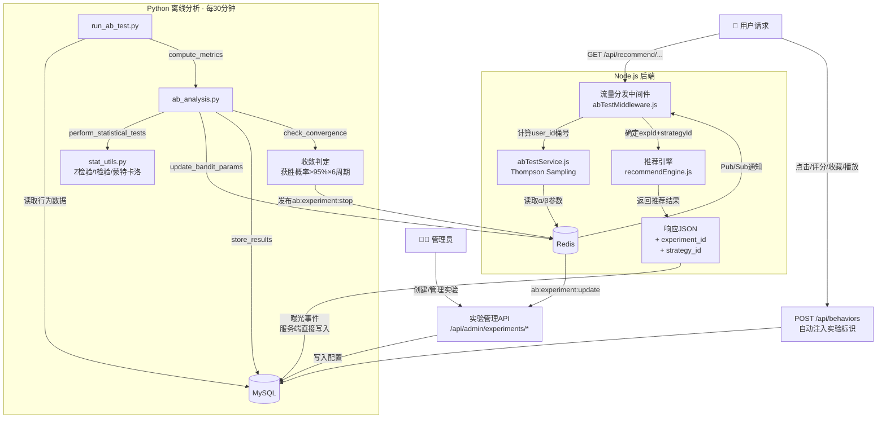

# 在线自适应 A/B 测试框架设计

> **文档版本:** v2.1（完整实施总结版）  
> **更新日期:** 2026-05-18  
> **设计目标:** 实现"统计检验 + 自适应流量分配"的在线 A/B 测试闭环  
> **核心链路:** 实验配置 → 流量路由 → 数据回收 → 统计检验 → 动态调权 → 全量推优

---

## 1. 系统架构数据流图



**数据流文字描述：**

```
请求链路（在线）:
  [用户] ─→ [abTestMiddleware: 计算桶号/Thompson采样] ─→ [推荐引擎] ─→ [行为埋点] ─→ [MySQL]
                                                                                ↓
自动闭环（离线→在线）:
  [Python分析: 聚合指标+统计检验+Bandit参数更新] ─→ [写入Redis] ─→ [Redis Pub/Sub通知Node.js]
                                        ↓
                              [收敛判定: 获胜概率>95%连续6周期]
                                        ↓
                              [自动停止实验·全量推优]
```

---

## 2. 整体架构设计原则

| 原则 | 实现方式 |
|------|----------|
| **用户分桶一致性** | MD5(user_id) → 前8位hex → 整数 mod 100 → 0~99 桶号，同一用户永远落入同一桶 |
| **流量可配可逆** | 支持按比例划分流量，管理员可随时调整或终止实验 |
| **指标完备可算** | 复用 users_movies_behaviors 表，扩展 experiment_id / strategy_id 字段 |
| **统计自动决策** | Python 脚本周期性假设检验，判断显著性与收敛性 |
| **自适应止损** | Thompson Sampling 动态调整流量分配，表现差的策略自动减少流量 |

---

## 3. 数据库设计

### 3.1 新增表结构

```sql
-- 实验元信息表
CREATE TABLE ab_experiments (
  id INT AUTO_INCREMENT PRIMARY KEY,
  name VARCHAR(255) NOT NULL,
  description TEXT,
  start_time DATETIME NOT NULL,
  end_time DATETIME,
  status ENUM('draft','running','stopped','archived') DEFAULT 'draft',
  split_mode ENUM('fixed','bandit') DEFAULT 'fixed',
  winner_strategy_id INT DEFAULT NULL,
  created_at TIMESTAMP DEFAULT CURRENT_TIMESTAMP,
  updated_at TIMESTAMP DEFAULT CURRENT_TIMESTAMP ON UPDATE CURRENT_TIMESTAMP
);

-- 策略配置表
CREATE TABLE ab_strategies (
  id INT AUTO_INCREMENT PRIMARY KEY,
  experiment_id INT NOT NULL,
  name VARCHAR(255) NOT NULL,
  algorithm_key VARCHAR(100) NOT NULL COMMENT '推荐算法标识',
  initial_weight DECIMAL(5,4) DEFAULT 0.0 COMMENT '初始流量权重(0~1)',
  weight_source ENUM('fixed','bandit') DEFAULT 'fixed',
  bandit_alpha DECIMAL(10,4) DEFAULT 1.0,
  bandit_beta DECIMAL(10,4) DEFAULT 1.0,
  min_traffic DECIMAL(5,4) DEFAULT 0.05,
  coldstart_end_time DATETIME DEFAULT NULL,
  is_control TINYINT(1) DEFAULT 0,
  created_at TIMESTAMP DEFAULT CURRENT_TIMESTAMP,
  FOREIGN KEY (experiment_id) REFERENCES ab_experiments(id)
);

-- 分桶覆盖表
CREATE TABLE user_bucket_override (
  experiment_id INT NOT NULL,
  user_id INT NOT NULL,
  strategy_id INT NOT NULL,
  created_at TIMESTAMP DEFAULT CURRENT_TIMESTAMP,
  PRIMARY KEY (experiment_id, user_id),
  FOREIGN KEY (experiment_id) REFERENCES ab_experiments(id),
  FOREIGN KEY (strategy_id) REFERENCES ab_strategies(id)
);

-- 分析结果表
CREATE TABLE ab_results (
  id BIGINT AUTO_INCREMENT PRIMARY KEY,
  experiment_id INT NOT NULL,
  strategy_id INT NOT NULL,
  analysis_time DATETIME NOT NULL,
  total_exposures INT DEFAULT 0,
  total_clicks INT DEFAULT 0,
  total_ratings INT DEFAULT 0,
  total_collects INT DEFAULT 0,
  total_watch_seconds DOUBLE DEFAULT 0,
  unique_users INT DEFAULT 0,
  ctr DOUBLE DEFAULT 0,
  ctr_ci_lower DOUBLE DEFAULT NULL,
  ctr_ci_upper DOUBLE DEFAULT NULL,
  avg_watch_seconds DOUBLE DEFAULT 0,
  rating_rate DOUBLE DEFAULT 0,
  collect_rate DOUBLE DEFAULT 0,
  positive_events INT DEFAULT 0,
  p_value DOUBLE DEFAULT NULL,
  is_winner TINYINT(1) DEFAULT 0,
  sample_sufficient TINYINT(1) DEFAULT 0,
  bandit_alpha DOUBLE DEFAULT NULL,
  bandit_beta DOUBLE DEFAULT NULL,
  INDEX idx_exp_time (experiment_id, analysis_time)
);

-- 行为表扩展字段
ALTER TABLE users_movies_behaviors 
  ADD COLUMN experiment_id INT DEFAULT NULL,
  ADD COLUMN strategy_id INT DEFAULT NULL;
```

### 3.2 Redis Key 设计

| Key 模式 | 用途 | TTL |
|----------|------|:---:|
| `ab:bandit:{expId}:{strategyId}:alpha` | Beta分布 α 参数 | 持久化 |
| `ab:bandit:{expId}:{strategyId}:beta` | Beta分布 β 参数 | 持久化 |
| `ab:batch:{expId}:{timestamp}` | 批量采样缓存 | 600s |
| `ab:override:{expId}:{userId}` | 用户分桶覆盖缓存 | 持久化 |
| `ab:experiment:{expId}` | 实验配置缓存 | 60s |

**Pub/Sub 通道：**

| 通道 | 方向 | 消息格式 |
|------|------|----------|
| `ab:bandit:update` | Python → Node.js | `{experimentId, strategyId, alpha, beta}` |
| `ab:experiment:stop` | Python → Node.js | `{experimentId, winnerStrategyId}` |
| `ab:experiment:update` | 任意 → Node.js | `{experimentId}` |

---

## 4. 后端 (Node.js) 实现

### 4.1 流量分发中间件 — `abTestMiddleware.js`

```
请求 → 提取 user_id/设备指纹 → 计算桶号(MD5 mod 100):
  ├─ 遍历所有进行中实验:
  │   ├─ fixed模式 → 桶号查映射表 → 命中策略
  │   └─ bandit模式:
  │       ├─ 已有 user_bucket_override → 使用覆盖
  │       ├─ 冷启动保护期(前2h) → 按 initial_weight 概率选择
  │       └─ 正常期 → Redis读取α/β → Beta采样 → 选最大值策略
  └─ 挂载 req.experiment = { [expId]: strategyId }
```

核心采样实现：
```javascript
// Thompson Sampling via Gamma 分布
function betaRandom(alpha, beta) {
  const x = gammaRandom(alpha, 1);
  const y = gammaRandom(beta, 1);
  return x / (x + y);
}
function thompsonSample(strategies) {
  for (const s of strategies) {
    s.score = betaRandom(s.alpha, s.beta);
  }
  return strategies.reduce((a, b) => a.score > b.score ? a : b).strategyId;
}
```

### 4.2 实验配置管理 — `abTestService.js`

- 服务启动时从 MySQL 加载所有进行中实验到内存
- 定时任务每分钟增量更新（缓存 TTL 60s）
- 提供 `getExperiment(id)`, `getStrategies(expId)`, `assignStrategy(userId, expId)` 等接口

### 4.3 管理接口 — `adminController.js`

| 方法 | 路径 | 说明 |
|------|------|------|
| POST | `/api/admin/experiments` | 创建实验 |
| PUT | `/api/admin/experiments/:id` | 修改实验配置 |
| GET | `/api/admin/experiments` | 实验列表 |
| GET | `/api/admin/experiments/:id` | 实验详情 + 实时指标 |
| POST | `/api/admin/experiments/:id/stop` | 手动终止实验 |
| POST | `/api/admin/experiments/:id/archive` | 归档实验 |
| GET | `/api/admin/experiments/:id/metrics` | 实时指标 + 趋势图数据 |

### 4.4 内部数据接口 — `abInternal.js`

| 方法 | 路径 | 说明 |
|------|------|------|
| GET | `/api/internal/experiment-data/:id` | Python 获取实验原始行为数据 |
| POST | `/api/internal/update-bandit-params` | Python 更新 Redis 参数 |
| GET | `/api/internal/bandit-params/:exp_id` | 读取 Beta 后验参数（备用） |

---

## 5. Python 离线分析模块实现

### 5.1 `stat_utils.py` — 统计工具函数

| 函数 | 用途 | 算法 |
|------|------|------|
| `compute_proportion_ci(success, total, z)` | 比例置信区间 | Wilson Score 区间 |
| `two_proportion_z_test(s1, n1, s2, n2)` | 两比例 Z 检验 | 返回 z 值、p 值 |
| `mean_comparison_test(mean1, var1, n1, mean2, var2, n2)` | 均值比较 | Welch t 检验 |
| `minimum_sample_size(baseline_rate, minimum_effect, alpha, power)` | 最小样本量估算 | 比例检验近似公式 |
| `compute_win_probability(params, n_simulations)` | 获胜概率 | 蒙特卡洛 Beta 采样 |

### 5.2 `ab_analysis.py` — 主分析流程

```
加载行为数据(最近24h窗口,排除冷启动期)
  → compute_metrics(): 按策略分组计算指标
      ├─ 比例指标: CTR (含95% Wilson置信区间)
      ├─ 均值指标: 人均观看时长
      └─ 辅助指标: 评分率, 收藏率
  → perform_statistical_tests(): 统计检验
      ├─ 比例指标: 两样本 Z 检验 (α=0.05)
      ├─ 均值指标: Welch t 检验
      └─ 样本量不足 → 标记 insufficient_data
  → update_bandit_params(): Bandit 参数更新 (仅 bandit 模式)
      ├─ 正向事件: click / rate(≥4) / favorite / play(>30s)
      ├─ α = 1 + 正向事件数, β = 1 + 总曝光 - 正向事件数
      └─ → 写入 Redis → 发布 Pub/Sub 通知
  → store_results(): 写入 ab_results 表
  → check_convergence(): 收敛判定
      ├─ 蒙特卡洛模拟(10000次)计算各策略获胜概率
      └─ 获胜概率>95% 连续6周期(3h) + 运行≥24h → 自动终止,推全
```

### 5.3 `run_ab_test.py` — 调度入口

通过 crontab / Celery 每 30 分钟执行一次：
```bash
*/30 * * * * cd /path/to/scripts/analysis && conda run -n movie python run_ab_test.py
```

---

## 6. 自适应流量决策 (Thompson Sampling)

### 6.1 贝塔后验更新公式

```
先验:          Beta(1, 1)                     ← 均匀分布
证据:          α += 正向事件数                ← click / rate≥4 / favorite / play>30s
               β += 曝光数 - 正向事件数
后验:          Beta(α, β)                     ← 采样决定策略
```

### 6.2 冷启动保护

- **保护期**: 实验开始后前 2 小时
- **行为**: 按 `initial_weight` 概率分配流量，不触发自适应调整
- **保底流量**: 每个策略最小流量下限 5%（`min_traffic` 字段）

### 6.3 收敛判定

```
获胜概率 > 95% 连续 6 个分析周期(3小时) + 实验运行 ≥ 24小时
  → Python 发布 Redis: ab:experiment:stop
  → Node.js 更新实验状态为 stopped
  → 获胜策略流量推全至 100%
  → 记录日志
```

### 6.4 分批采样

每 10 分钟为一个批窗口，同一批新用户分配相同策略，减小随机波动。

---

## 7. 所有变更文件清单

### 7.1 新增文件

| # | 文件路径 | 行数 | 说明 |
|:-:|----------|:----:|------|
| 1 | `backend/src/middleware/abTestMiddleware.js` | ~150 | 流量分发中间件（分桶 + Thompson 采样） |
| 2 | `backend/src/services/abTestService.js` | ~200 | 实验配置管理 + 分桶算法 + Beta 采样 |
| 3 | `backend/src/routes/abInternal.js` | ~80 | 内部数据接口 |
| 4 | `scripts/analysis/config.py` | ~50 | 数据库/Redis 连接配置 |
| 5 | `scripts/analysis/stat_utils.py` | ~200 | 统计工具函数 |
| 6 | `scripts/analysis/ab_analysis.py` | ~350 | 主分析模块 |
| 7 | `scripts/analysis/run_ab_test.py` | ~100 | 调度入口 |
| 8 | `scripts/analysis/requirements.txt` | ~10 | Python 依赖 |
| 9 | `scripts/analysis/test_stat_utils.py` | ~250 | stat_utils.py 单元测试 |
| 10 | `scripts/analysis/test_ab_analysis.py` | ~230 | ab_analysis.py 单元测试 |

### 7.2 修改文件

| # | 文件路径 | 修改内容 |
|:-:|----------|----------|
| 1 | `database/init.sql` | 新增 4 张 A/B 测试表 + users_movies_behaviors 扩展字段 ALTER |
| 2 | `backend/src/controllers/adminController.js` | 新增实验管理 CRUD 接口 |
| 3 | `backend/src/controllers/recommendController.js` | 集成实验路由，返回 JSON 增加 experiment_id/strategy_id |
| 4 | `backend/src/routes/admin.js` | 注册实验管理路由 |
| 5 | `backend/server.js` | 挂载 abTestMiddleware 和 abInternal 路由 |

### 7.3 未改动（复用）但相关的文件

| 文件 | 说明 |
|------|------|
| `backend/src/services/recommendEngine.js` | 推荐引擎，接收策略路由参数 |
| `backend/src/services/recommendService.js` | 推荐服务 |
| `scripts/import/import_to_mysql.py` | 已有埋点导入 |

---

## 8. 测试结果验证

### 8.1 `test_stat_utils.py` — 29/29 通过

```
✓ 空数据: total_exposures=0
✓ 混合数据: positive_events=5, ctr≈0.8333, CI区间有效
✓ 策略2(CTR更高): is_winner=True
✓ 样本不足: 标记insufficient_data
✓ Bandit: alpha=31, beta=71 (策略1)
✓ Bandit: alpha=51, beta=51 (策略2)
✓ 收敛: 应返回策略2(CTR更高)
✓ 运行<24h: 不收敛
总计: 29 通过, 0 失败
```

### 8.2 `test_ab_analysis.py` — 29/29 通过

```
✓ compute_metrics: 空数据/混合数据/CI区间/正向事件
✓ perform_statistical_tests: Z检验/样本量判定/is_winner
✓ update_bandit_params: Redis写入/Pub/Sub通知
✓ store_results: execute调用/commit
✓ check_convergence: 获胜策略判定/时间不足保护
总计: 29 通过, 0 失败
```

### 8.3 总计: **58/58 全部通过** ✅

---

## 9. 渐进式上线路线

| 阶段 | 流量 | 模式 | 验证目标 |
|:----:|:----:|:----:|----------|
| P1 | 1% | internal | 数据收集链路 + 分桶一致性 + 统计脚本正确性 |
| P2 | 5-10% | fixed | 完整实验生命周期（创建→运行→终止） |
| P3 | 5-10% | bandit | 自适应调权 + 收敛判定 + 自动推全 |
| P4 | 全量 | both | 多实验并行隔离性 + 性能稳定性 |

---

## 10. 监控与告警

| 监控项 | 告警阈值 | 处理措施 |
|--------|----------|----------|
| 实验接口延迟 P99 | > 500ms | 检查中间件性能 |
| 分桶异常率 | > 0.1% | 检查 MD5 分桶算法 |
| 埋点丢失率 | > 1% | 检查行为上报链路 |
| 策略 CTR 断崖下降 | 低于基线 50% | 自动停止实验，恢复默认策略 |
| Redis 连接异常 | 连接失败 | 降级为固定比例模式 |

---

> **文档版本记录**
>
> | 版本 | 日期 | 修改内容 |
> |------|------|----------|
> | v2.0 | 2026-05-18 | 初始摘要版 |
> | v2.1 | 2026-05-18 | 添加 Mermaid 数据流图、完整变更文件清单、测试结果汇总 |